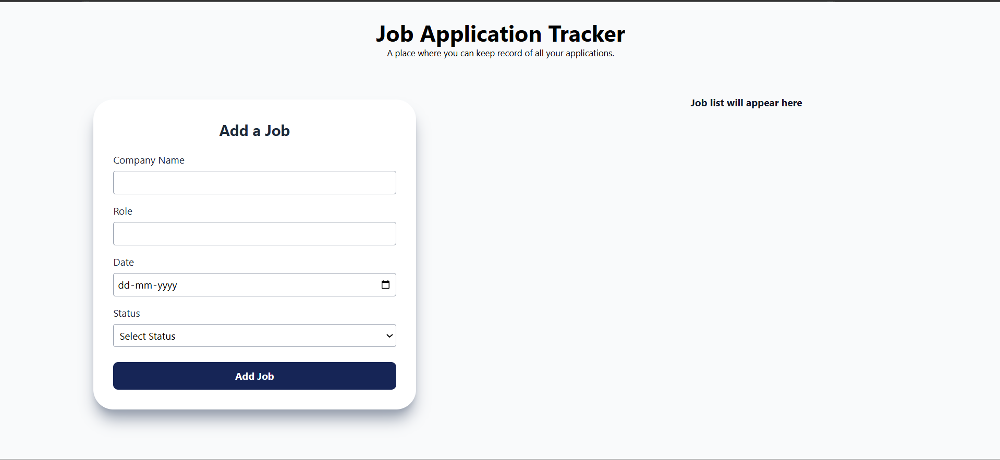

# 🚀 Job Application Tracker

A React-based web application to efficiently track and manage job applications in one place.

🔗 **Live Demo:** https://job-application-tracker-lyart-theta.vercel.app/

---

## 📌 Features

- ➕ Add new job applications  
- ✏️ Edit existing entries  
- ❌ Delete individual jobs or clear all  
- 🔍 Search by company name or role  
- 💾 Data persistence using localStorage  
- 🈸 Same form for adding and editing entries
- 📱 Responsive and clean UI  

---

## 🛠️ Tech Stack

- React.js  
- Context API (State Management)  
- JavaScript (ES6+)  
- Tailwind CSS  
- LocalStorage  

---

## 📸 Screenshots


![Home Page with entries] (./screenshots/HomeList.png)

---

## 🧠 What I Learned

- Managing global state using Context API  
- Building controlled forms in React  
- Implementing search functionality with filtering  
- Handling real-world UI states (empty, filtered, updated)  
- Deploying applications using Vercel  

---

## 🚀 Getting Started

Clone the repository:

```bash
git clone https://github.com/bhawnapandit26/job-application-tracker.git
cd job-application-tracker
npm install
npm start